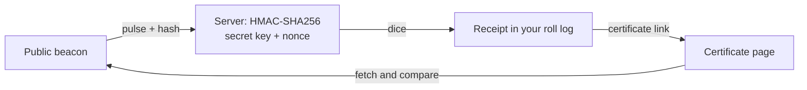

# roll-verification-spec

From the team behind [dnddiceroller.com](https://dnddiceroller.com) · [more from us](https://github.com/dnddiceroller)

**Roll dice. Keep the receipt.**

On dnddiceroller.com, dice can come from a public randomness beacon: NIST by default, drand as the fallback. In NIST Beacon mode every roll gets a receipt naming the beacon record behind it, and a certificate link you can check against the beacon yourself. No account with us, no trust in us.

This repo explains what that receipt means. It is a specification, not source code.

## In one minute

- **A receipt** names the beacon pulse your dice came from, plus the first 12 hex digits of its hash.
- **A certificate** is a link like `/certificate?src=nist-beacon&chain=2&pulse=1966282&hash=…`. Open it and your browser fetches the record from NIST or drand and says whether the hash matches.
- **A match proves** the record is real and existed at that moment, so nobody picked your roll in advance.
- **A match does not prove** the exact number. The dice are derived with a secret server key and a per-request nonce, so nobody watching the beacon can predict your roll. The flip side: nobody can recompute it from the public record either.
- **Secure Enclave (device) rolls** have no receipt. There is no public record to point at.

## Read

- [SPEC.md](SPEC.md): sources, receipt format, certificate URL, the check, the derivation, and exactly what is and is not proved.

## Try it

- Check a receipt from the command line: [examples/verify-receipt.mjs](https://github.com/dnddiceroller/examples)
- Look at a beacon record directly: https://beacon.nist.gov/beacon/2.0/pulse/last

## Licence

MIT. Copyright Iron Code Studios.
