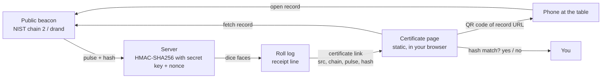

# Roll receipts and certificates

Version 1 · 2 Oct 2026 · describes dnddiceroller.com as live on that date

## 1. Sources

The source picker under the roller has three choices:

| Choice | Dice come from | If it cannot be reached |
| --- | --- | --- |
| **NIST Beacon** (default) | NIST Randomness Beacon v2, chain 2. A pulse every 60 seconds. https://beacon.nist.gov | drand, then your device |
| **drand Beacon** | drand, League of Entropy. A round every 30 seconds. https://api.drand.sh | NIST, then your device |
| **Secure Enclave** | your device's cryptographic generator | (nothing below it) |

A source qualifies only if anyone can check it without asking us and without trusting us. That rules out sources that produce good random bytes but publish no record.

## 2. The receipt

In **NIST Beacon** mode, after each roll (one Roll, or everything a Roll All produced), the roll log prints one receipt line. For each beacon record the dice drew on, it shows:

| Part | Example | Meaning |
| --- | --- | --- |
| Record name | `NIST pulse #1966282` | Links to the beacon's own record |
| Short hash | `ca3a91d8e43b…` | First 12 hex digits of the record's output |
| `certificate` | link | The full record and how the roll was derived (section 3) |

A receipt can name **two records**. A roll can consume bytes across the boundary between one pulse and the next, or start on NIST and finish on the drand fallback. Both really were used, so both are named.

A receipt can end in **`+ device`**. The beacons were unreachable partway through, and part of the roll used device randomness.

Secure Enclave rolls print no receipt. Device randomness has no public record to point at.

Receipts live in the roll log on your screen. Nothing about a roll is stored on our servers, so copy the certificate link if you want to keep it.

## 3. The certificate URL

```
https://www.dnddiceroller.com/certificate?src=nist-beacon&chain=2&pulse=<pulse>&hash=<outputValue>
https://www.dnddiceroller.com/certificate?src=drand&chain=<chain hash>&pulse=<round>&hash=<randomness>
```

| Parameter | NIST | drand |
| --- | --- | --- |
| `src` | `nist-beacon` (also the default) | `drand` |
| `chain` | chain index, `2` | the drand chain hash (64 hex) |
| `pulse` | pulse index | round number |
| `hash` | the pulse's `outputValue` (128 hex) | the round's `randomness` (64 hex) |

`hash` is optional. Without it, the page reads the value from the beacon and shows it.

Every value in the link is public record. The link contains nothing secret.

## 4. Checking it

The certificate is a static page. It signs nothing and calls no server of ours. It:

1. Builds the beacon's own URL for the record:
   - NIST: `https://beacon.nist.gov/beacon/2.0/chain/<chain>/pulse/<pulse>`
   - drand: `https://api.drand.sh/<chain>/public/<round>`
2. Fetches that record from your browser, straight from the beacon.
3. Compares the beacon's value (NIST `pulse.outputValue`, drand `randomness`) with `hash`, as hex, ignoring case. It says **match** or **does not match**, in words.
4. Shows the issue time (NIST records carry a timestamp).
5. Draws a QR code of the beacon's URL for that record, so a player at the table can open the record on a phone without going through our site.

Anyone can repeat steps 1 to 3 with `curl`, a browser, or [verify-receipt.mjs](https://github.com/dnddiceroller/examples).

The page does not check the beacon's signature on the record. It relies on HTTPS to the beacon. NIST and drand both publish what you need to check signatures yourself.

## 5. From pulse to dice

Dice faces come from:

```
HMAC-SHA256(server key, "chain:pulse:hash:account:nonce:counter")
```

- **server key**: a secret held by the server. Never published.
- **chain, pulse, hash**: the public beacon record.
- **account**: an identifier for the account rolling.
- **nonce**: a per-request value. Never published.
- **counter**: increments to produce as many bytes as the roll needs.

The key and nonce are secret on purpose. If the derivation used only public inputs, anyone watching the beacon could compute every roll before it happened.

## 6. What a receipt proves, and what it does not

**It proves:**

- The record is genuine. The beacon itself holds that hash for that pulse or round.
- The record existed at a fixed public moment. Beacon outputs are unpredictable before they are issued, so the roll's input could not have been chosen in advance.
- How a roll is derived from the record (section 5).

**It does not prove:**

- The number you rolled. Without the server key and nonce, nobody, including you, can recompute the dice from the public record. That is the trade: unpredictable to outsiders, and therefore not independently recomputable.
- Anything about device-randomness rolls. They have no public record, so they have no receipt.
- That the certificate comes from us. It is not a signed document. It is a page that reads its own URL and asks the beacon.

## 7. Diagram


